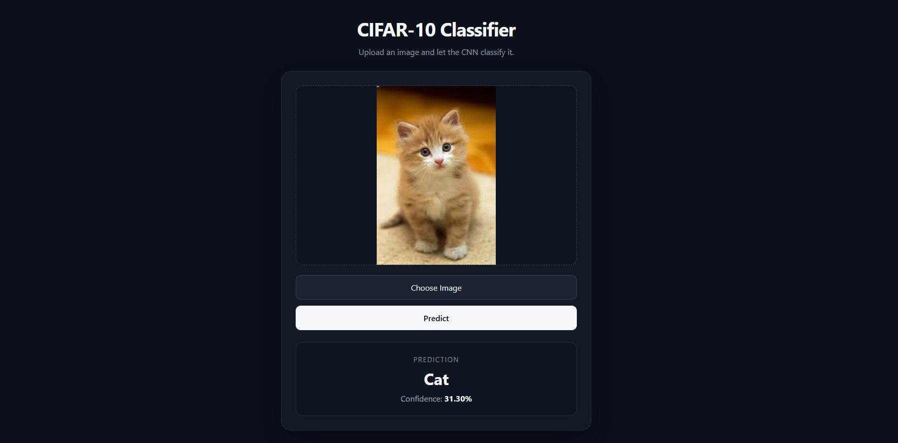

# 🧠 CIFAR-10 Image Classifier

> An end-to-end computer vision application that takes an image from a React frontend, sends it to a FastAPI backend, and uses a PyTorch CNN to classify it into one of the 10 CIFAR-10 categories.

<p align="center">

  
  
  
  
  

</p>



## ✨ Overview

This project demonstrates a complete machine-learning workflow:

```text
                    ┌─────────────────┐
                    │   React + TS    │
                    │    Frontend     │
                    └────────┬────────┘
                             │
                        Image Upload
                             │
                             ▼
                    ┌─────────────────┐
                    │     FastAPI     │
                    │      API        │
                    └────────┬────────┘
                             │
                      Image Processing
                             │
                             ▼
                    ┌─────────────────┐
                    │   PyTorch CNN   │
                    │     Model       │
                    └────────┬────────┘
                             │
                       Class + Confidence
                             │
                             ▼
                    ┌─────────────────┐
                    │  React Result   │
                    └─────────────────┘
```

The application supports image upload, preprocessing, CNN inference, class prediction, and confidence reporting.

---

## 🎯 CIFAR-10 Classes

The model predicts one of the following classes:

| ID | Class |
|---:|---|
| 0 | ✈️ Airplane |
| 1 | 🚗 Automobile |
| 2 | 🐦 Bird |
| 3 | 🐱 Cat |
| 4 | 🦌 Deer |
| 5 | 🐶 Dog |
| 6 | 🐸 Frog |
| 7 | 🐴 Horse |
| 8 | 🚢 Ship |
| 9 | 🚚 Truck |

---

## 🧠 Model

The classifier is a convolutional neural network implemented using PyTorch.

### Architecture

```text
Input
  │
  ▼
Conv2D (3 → 6)
  │
BatchNorm
  │
ReLU
  │
MaxPool
  │
  ▼
Conv2D (6 → 16)
  │
BatchNorm
  │
ReLU
  │
MaxPool
  │
  ▼
Flatten
  │
  ▼
Linear (400 → 128)
  │
ReLU
  │
Dropout
  │
  ▼
Linear (128 → 64)
  │
ReLU
  │
Dropout
  │
  ▼
Linear (64 → 10)
  │
  ▼
Class Logits
```

The model uses:

- Convolutional layers
- Batch Normalization
- ReLU activation
- Max Pooling
- Dropout
- Fully connected layers
- Cross Entropy Loss
- Adam optimizer

---

## 🏋️ Training

The training pipeline includes:

- Training / validation / test split
- Data augmentation
- CUDA acceleration
- Mini-batch training
- Adam optimization
- Validation loss monitoring
- Early stopping
- Best-model checkpointing

The trained checkpoint is intentionally excluded from Git because model binaries can become large.

---

## ⚡ GPU Training

The project supports CUDA automatically when a compatible GPU is available.

```python
device = torch.device(
    "cuda" if torch.cuda.is_available() else "cpu"
)
```

Training batches are transferred using non-blocking CUDA transfers where appropriate.

---

## 🔌 FastAPI Backend

The backend exposes a prediction endpoint:

```http
POST /predict
```

The endpoint accepts an uploaded image and returns:

```json
{
  "class_name": "cat",
  "confidence": 31.30
}
```

### Inference pipeline

```text
Uploaded Image
      │
      ▼
PIL Image
      │
      ▼
RGB Conversion
      │
      ▼
Resize → 32 × 32
      │
      ▼
Tensor
      │
      ▼
Batch Dimension
      │
      ▼
PyTorch CNN
      │
      ▼
Logits
      │
      ▼
Softmax
      │
      ▼
Prediction + Confidence
```

---

## ⚛️ React Frontend

The frontend is built with:

- React
- TypeScript
- Vite
- Native Fetch API
- CSS

Users can:

1. Select an image
2. Preview the image
3. Send it to the FastAPI backend
4. View the predicted class
5. View the model confidence

---

## 📁 Project Structure

```text
cifar10/
│
├── data/                         # Local CIFAR-10 dataset
│
├── models/                       # Local model checkpoints
│   └── model.pth
│
├── src/
│   └── cifar10_pytorch/
│       ├── api/
│       │   ├── main.py           # FastAPI endpoints
│       │   └── model_loader.py   # Model loading/inference setup
│       │
│       ├── config.py             # Centralized project paths
│       ├── model.py              # CNN architecture
│       └── train.py              # Training pipeline
│
├── cifar10-frontend/
│   ├── src/
│   │   ├── App.tsx
│   │   └── App.css
│   ├── package.json
│   └── ...
│
├── .gitignore
├── pyproject.toml
├── uv.lock
└── README.md
```

---

## 🚀 Getting Started

### 1. Clone the repository

```bash
git clone https://github.com/brainDensed/CIFAR10.git
cd cifar10
```

---

### 2. Backend setup

This project uses `uv` for Python dependency management.

```bash
uv sync
```

---

### 3. Train the model

```bash
uv run python -m cifar10_pytorch.train
```

The best checkpoint will be saved to:

```text
models/model.pth
```

---

### 4. Start FastAPI

```bash
uv run uvicorn cifar10_pytorch.api.main:app --reload
```

API:

```text
http://127.0.0.1:8000
```

Interactive API documentation:

```text
http://127.0.0.1:8000/docs
```

---

### 5. Start the React frontend

```bash
cd cifar10-frontend
npm install
npm run dev
```

Open the URL shown by Vite, usually:

```text
http://localhost:5173
```

---

## 🧪 API Example

### Request

```http
POST /predict
Content-Type: multipart/form-data
```

### Response

```json
{
  "class_name": "cat",
  "confidence": 31.30
}
```

---

## 🛠️ Tech Stack

### Machine Learning

- Python
- PyTorch
- Torchvision
- NumPy
- scikit-learn

### Backend

- FastAPI
- Uvicorn
- Pillow

### Frontend

- React
- TypeScript
- Vite
- CSS

### Hardware

- CUDA
- NVIDIA GPU acceleration

---

## 📌 What I Learned

This project was built to understand the complete path from model development to deployment.

Key areas covered:

- CNN architecture
- Convolution and feature extraction
- Multi-channel image tensors
- Batch Normalization
- Dropout
- Data augmentation
- Train / validation / test workflows
- Early stopping
- Model checkpointing
- CUDA training
- PyTorch inference
- Image preprocessing
- FastAPI file uploads
- REST API inference
- React + TypeScript integration
- Connecting an ML model to a frontend

---

## 🔮 Future Improvements

Possible next steps:

- [ ] Improve CIFAR-10 classification accuracy
- [ ] Add richer prediction visualization
- [ ] Add confidence visualization
- [ ] Add automated API tests
- [ ] Dockerize the backend
- [ ] Deploy the FastAPI service
- [ ] Deploy the React frontend
- [ ] Add CI/CD
- [ ] Experiment with a deeper CNN
- [ ] Compare the custom CNN with transfer learning

---

## 📜 License

This project is for learning and demonstration purposes.
